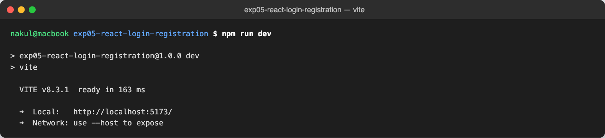
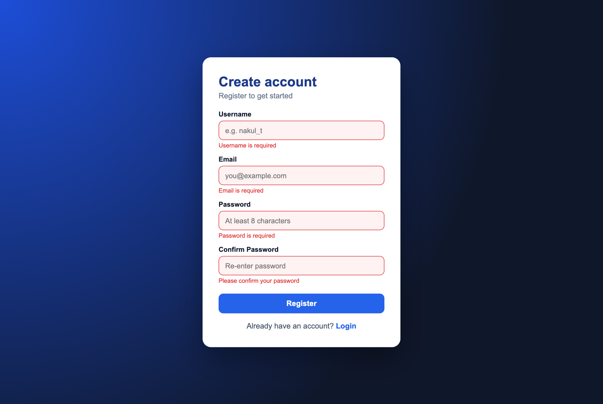
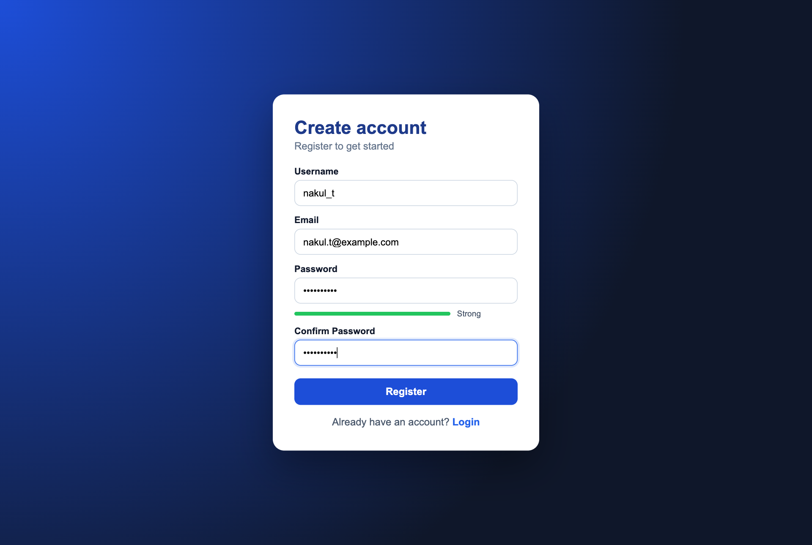
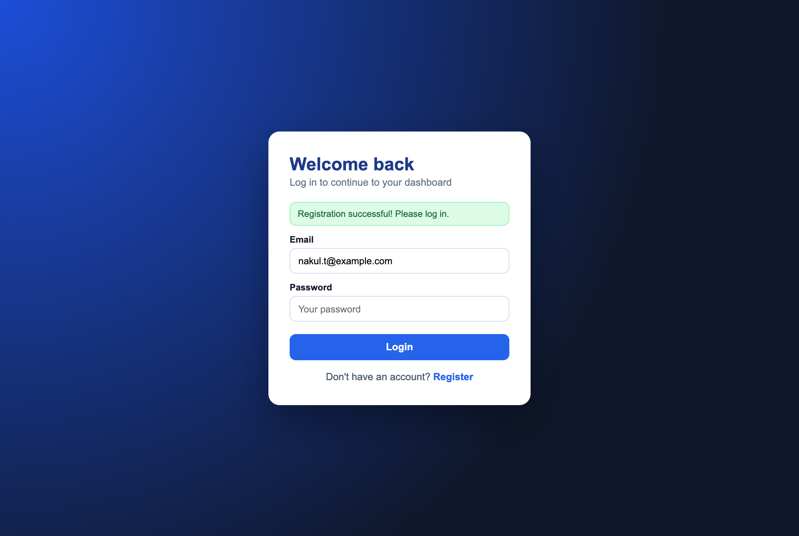
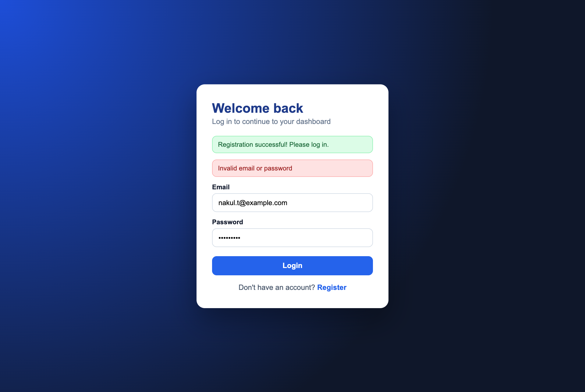
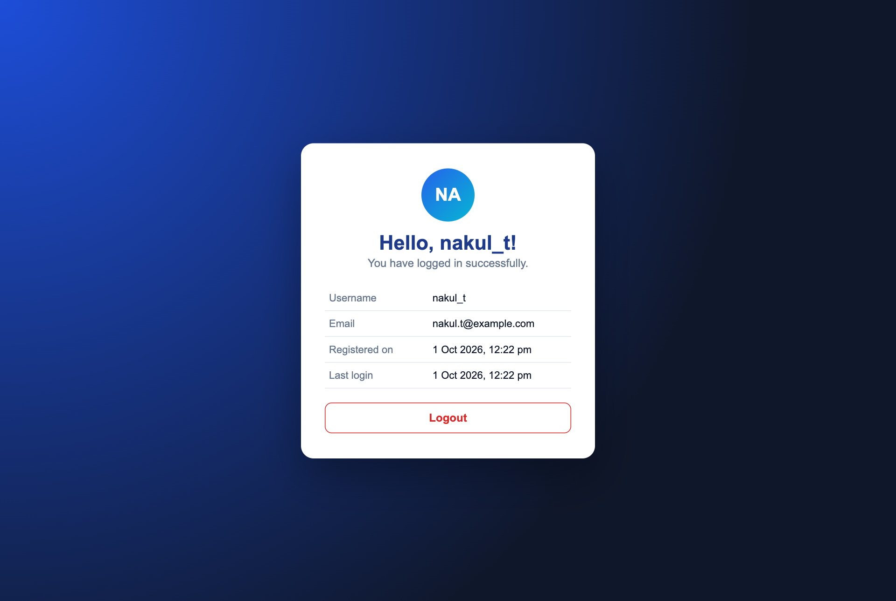
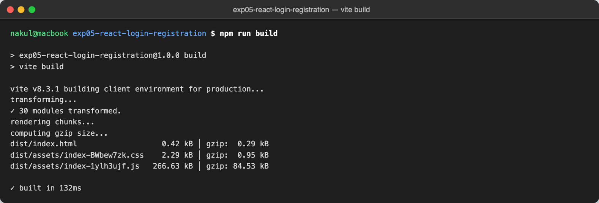

# Login and Registration Application using React.js

> **Application Development Laboratory (U21AD502) — Experiment 05**
> Prepared by **Nakul T (24AD068)**, Department of Artificial Intelligence and Data Science, KPR Institute of Engineering and Technology.

## Project Overview

A single-page React.js application with separate Registration, Login and Dashboard components connected through React Router. Forms are controlled with the useState hook and validated on the client. A simulated backend stores registered users in localStorage with SHA-256 hashed passwords and logs each API call to the console.

**Aim:** To develop a web application for login and registration functionalities using React.js.

## Features

- Registration form: username, email, password and confirm password with validation
- Live password-strength meter
- Login form with email/password validation and invalid-credential error
- Success message on the login page after registration (email pre-filled)
- Protected dashboard route showing the logged-in user's details, with logout
- Routing with React Router (/register, /login, /dashboard) and redirects based on session
- Simulated backend: users and session kept in localStorage, passwords stored as SHA-256 hashes
- Reusable InputField component

## Tech Stack

| Layer | Technology |
|---|---|
| Library | React 19 (functional components, hooks) |
| Routing | React Router |
| Build tool | Vite |
| Styling | CSS3 |
| Storage | localStorage + Web Crypto API (SHA-256) |

## Folder Structure

```
exp05-react-login-registration/
├── .gitignore
├── LICENSE
├── README.md
├── index.html
├── package.json
├── screenshots/   (output screenshots)
├── src/
│   ├── App.jsx
│   ├── auth.js
│   ├── components/
│   │   ├── Dashboard.jsx
│   │   ├── InputField.jsx
│   │   ├── Login.jsx
│   │   └── Registration.jsx
│   ├── index.css
│   ├── main.jsx
│   └── validation.js
└── vite.config.js
```

## Setup and Installation

1. Install Node.js 18 or later.
2. Clone the repository: `git clone https://github.com/nakultt/exp05-react-login-registration.git`
3. Open the folder: `cd exp05-react-login-registration`
4. Install dependencies: `npm install`

## How to Run

```bash
npm run dev
```

Open <http://localhost:5173>. Register a new account, then log in with the same email and password.

Production build:

```bash
npm run build
npm run preview
```

## Screenshots

### 1. Vite development server running (npm run dev)



### 2. Registration form showing validation errors



### 3. Registration form filled with password-strength meter



### 4. Login page after successful registration



### 5. Login rejected for an incorrect password



### 6. Dashboard after successful login



### 7. Production build created with npm run build



## Result

The project was successfully developed and executed, and the output was verified.

## Author

**Nakul T** — 24AD068 · B.Tech Artificial Intelligence and Data Science · [github.com/nakultt](https://github.com/nakultt)
